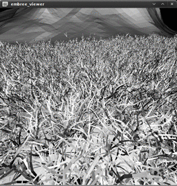
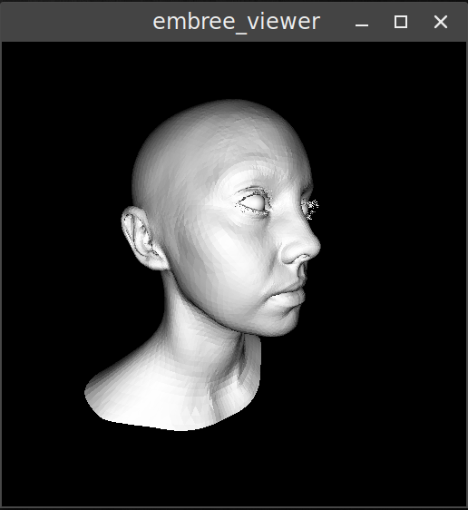
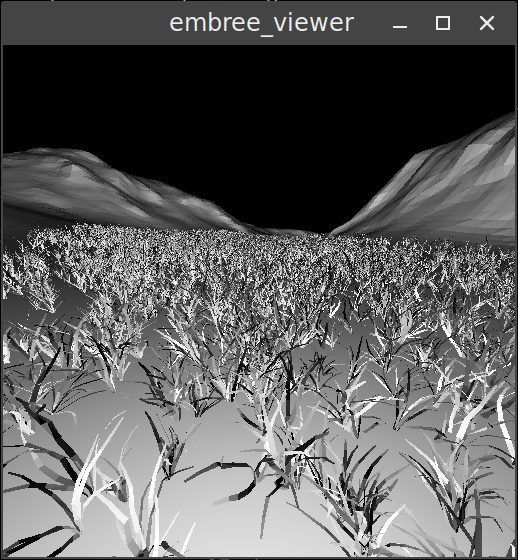

# Embree Viewer



Embree viewer is a simple implementation of a **progressive renderer**, based on Intel's [Embree raytracing kernels](https://embree.github.io/). Its UI is written in [SDL2](https://www.libsdl.org/), and it supports [Alembic](http://www.alembic.io/) and OBJ model file formats, with a simple JSON file to describe a scene.

## Use case

Embree viewer is intended as a simple example implementation of a progressive renderer with Embree, one step above the simple examples Embree ships with, but significantly simpler than [Ospray](https://github.com/ospray/ospray) and similar.

Its main purpose is to demonstrate the **performance** of Embree raytracing kernels, and the **scalability** of its instancing system, in a simple **real-time multithread framework** that can load common model files. It is not intended as a full raytracer - it does not have any support for materials, textures, normals, lighting or sampling.

## Clarisse scripts

Isotropix Clarisse is a professional lighting tool, heavily focusing on efficient object instancing. It is available as a professional package, or as a Personal Learning Edition.

For the purposes of experimentation with Embree, the `clarisse` directory contains a number of PLE scene files, with a set of scripts to export their scattering setup to a set of JSON and binary files compatible with Embree viewer.

# Building

Embree viewer was developed on a standard installation of Debian Linux; it has not been tested on MS Windows (any contribution in that respect would be appreciated).

## Dependencies

Non-standard dependencies, which have to be compiled on the target Linux machine, and installed into a location available to CMake:

- [Embree 3.0+](https://github.com/embree/embree/releases)
- [Alembic 1.7+](https://github.com/alembic/alembic/releases)

Standard dependencies, available in Debian (or other Linux distro):

- Boost (tested against 1.62.0)
- OpenEXR and IlmBase (tested against 2.2.0)
- SDL2 (tested against 2.0.5)
- TBB (tested against 4.3)

## Compilation

The repository contains a standard set of CMake build files:

```
mkdir build
cmake ..
make -j
```

# Usage

## Command line options

```
Allowed options:
  --help                produce help message
  --mesh arg            load mesh file (.abc, .obj)
  --scene arg           load a scene file (.json)
```

## Example files

Embree viewer comes with a small number of example files in the data directory (each directory includes a LICENSE file for the files it contains):

### Virtual Emily mesh



Virtual Emily project's main mesh, demonstrating how to load a single model file.

```
/embree_viewer --mesh data/Emily/Emily_2_1_Alembic_Scene.abc
```

### A Grass Scatterer



A simple scattering scene, using assets exported from Blender and Clarisse, showing the performance and possible complexity of the scene.

```
/embree_viewer --scene data/Grass/scene.json
```

## License and contributions

This demo is licensed under **MIT license**, and as such you can use this code for both commercial and noncommercial purposes.

Any **contribution is welcome**, in terms of ideas, improvements, bugfixes or additional example files.
